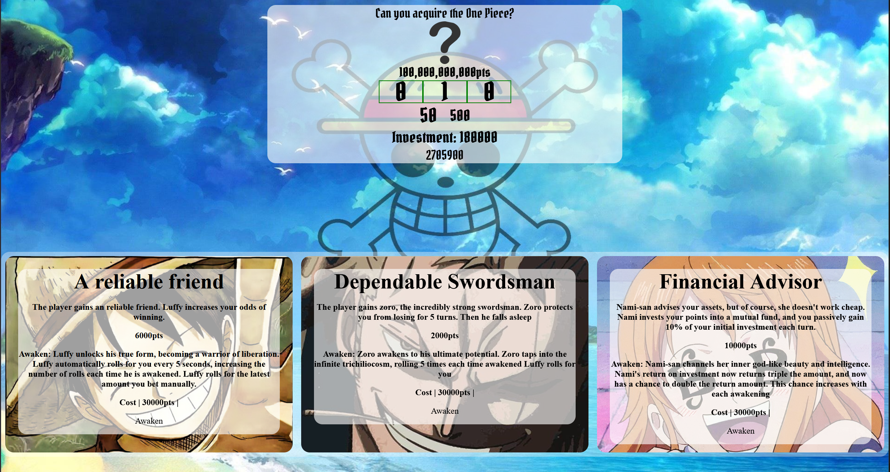

# 🎰 Week05 Bootcamp2019 Project: Slot Machine

### Goal: Build a Simple Slot Machine

Build a simple slot machine with minimum 5 items per reel and 3 reels - user should be able to bet min or max and have their total update

### How to submit your code for review:

- Fork and clone this repo
- Create a new branch called answer
- Checkout answer branch
- Push to your fork
- Issue a pull request
- Your pull request description should contain the following:
  - (1 to 5 no 3) I completed the challenge
  - (1 to 5 no 3) I feel good about my code
  - Anything specific on which you want feedback!

Example:
```
I completed the challenge: 5
I feel good about my code: 4
I'm not sure if my constructors are setup cleanly...
```


Can you acquire the one piece?

Can you get enough points to reach the one piece? Asking for help from Luffy, Zoro, and Nami gives you powerups, and changes the way you play the game! Unlock each friend, and awaken them to show off their true power!


Live demo! https://canyougettheonepiece.netlify.app/


How It's Made

Tech used: HTML, CSS, JavaScript

I had a lot of fun with this project! I considered what makes a game enjoyable. I aimed to create a challenge at the beginning, but quickly the gameplay evolves into something different! I utilized various variables, simple conditional logic, and the Math.random() function in JavaScript to achieve the main engine of the gameplay.  

Optimizations

(optional)

If I had more time for this project, I wouldmake the win button a little better, and make sure that it doesn't push down the friends section. Also I would make the white backgorund in the friends section wrap around the friends more tightly when the screen shrinks in size.

Lessons Learned:

I learned a lot about how simple conditional logic can go a long way. You really can make most anything you can think of with simple functions and variables! The fundamentals of coding always are important. I learned about event bubbling, and used it to make the "awaken" button not adopt the same behavior as its parent event listener, using the stopPropogation property on the event object.